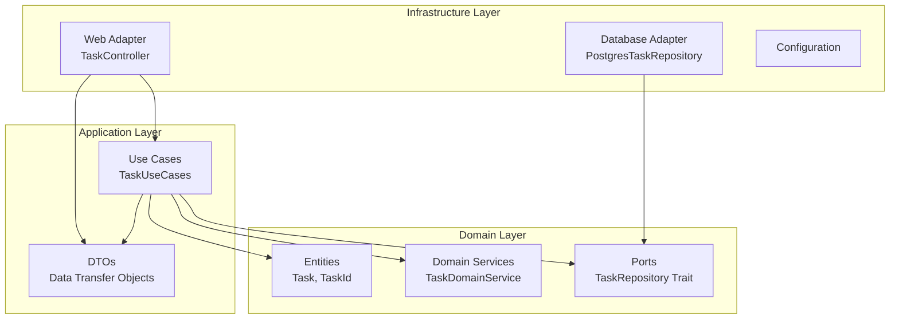

# axum_postgres_rust - Hexagonal Architecture

This project is a **REST API** for managing tasks, built using the *Rust programming language* and following **Hexagonal Architecture** (Ports and Adapters) principles. It uses the **Axum** framework for web handling, *SQLx* for database interactions, and **Docker** for containerized deployment. The architecture ensures clean separation of concerns, testability, and maintainability.

**Source Repository:** [axum_postgres_rust](https://github.com/fabiofaleiros/axum_postgres_rust)

## 🏗️ Architecture Overview



## 🎯 Key Benefits

- **🔧 Testability**: Easy to mock external dependencies via ports
- **🔄 Flexibility**: Can swap implementations without changing business logic  
- **📦 Modularity**: Clear separation between business logic and infrastructure
- **🛡️ Maintainability**: Changes in one layer don't affect others
- **⚡ Dependency Inversion**: Domain layer has no external dependencies

## 📁 Project Structure

```
src/
├── domain/              # 🏛️ Pure business logic
│   ├── entities/        # Core business entities (Task)
│   ├── value_objects/   # Domain value objects (TaskId)
│   ├── services/        # Domain services (validation, business rules)
│   └── ports/          # Interface definitions (TaskRepository trait)
│
├── application/        # 🔄 Use cases and application logic
│   ├── dto/            # Data transfer objects
│   └── use_cases/      # Application use cases (TaskUseCases)
│
├── infrastructure/     # 🔌 External adapters
│   ├── adapters/
│   │   ├── repositories/  # Database implementations (PostgresTaskRepository)
│   │   └── web/          # HTTP adapters (TaskController)
│   └── persistence/    # Database schema and migrations
│
├── config/             # ⚙️ Application configuration
├── database/           # 🗄️ Database connection management
└── responses/          # 📝 API response structures
```

## 🚀 Quick Start

1. **Clone the repository**
   ```bash
   git clone https://github.com/fabiofaleiros/axum_postgres_rust
   cd axum_postgres_rust
   ```

2. **Start the database**
   ```bash
   docker-compose up -d postgres
   ```

3. **Run the application**
   ```bash
   cargo run
   ```

4. **Test the API**
   ```bash
   # Health check
   curl http://127.0.0.1:7878/health
   
   # Get all tasks
   curl http://127.0.0.1:7878/tasks
   
   # Create a new task
   curl -X POST http://127.0.0.1:7878/tasks \
     -H "Content-Type: application/json" \
     -d '{"name":"Test Task","priority":5}'
   ```

## 📚 Documentation Chapters

### Original Tutorial (Updated for Hexagonal Architecture)
1. [Axum Web Router](readme_files/01_axum_web_router.md)
2. [Handler Functions & Shared State](readme_files/02_handler_functions___shared_state.md)
3. [Compile-Time Verified SQL](readme_files/03_compile_time_verified_sql.md)
4. [Application Configuration](readme_files/04_application_configuration.md)
5. [Containerized Environment](readme_files/05_containerized_environment.md)

### Hexagonal Architecture Deep Dive
6. [Hexagonal Architecture Overview](readme_files/06_hexagonal_architecture.md)
7. [Domain Layer Design](readme_files/07_domain_layer.md)
8. [Application Layer & Use Cases](readme_files/08_application_layer.md)
9. [Infrastructure Adapters](readme_files/09_infrastructure_adapters.md)
10. [Dependency Injection & Testing](readme_files/10_dependency_injection_testing.md)

## 🔧 API Endpoints

| Method | Endpoint | Description |
|--------|----------|-------------|
| GET | `/` | API information |
| GET | `/health` | Health check |
| GET | `/tasks` | Get all tasks |
| GET | `/tasks?priority=N` | Filter tasks by priority |
| GET | `/tasks/{id}` | Get task by ID |
| POST | `/tasks` | Create new task |
| PATCH | `/tasks/{id}` | Update task |
| DELETE | `/tasks/{id}` | Delete task |

---
