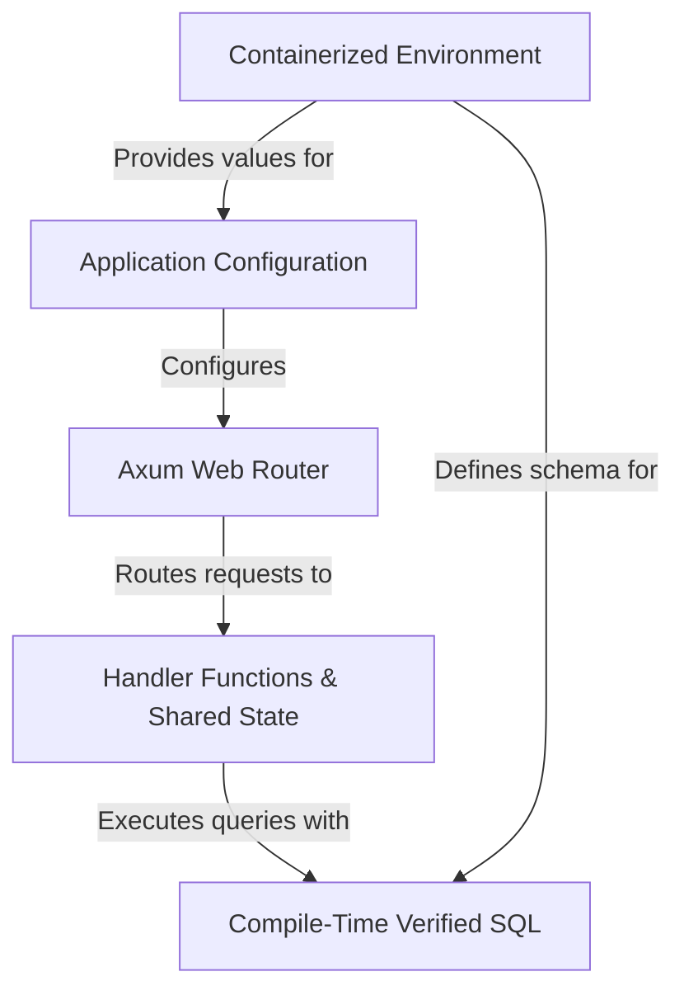

# Tutorial: axum_postgres_rust

This project is a simple **REST API** for managing tasks, built using the *Rust programming language*. It uses the **Axum** framework to handle web requests, *SQLx* to securely interact with a **PostgreSQL** database using *compile-time checked queries*, and **Docker** to provide a consistent, containerized environment for running the application. Configuration is managed through environment variables, making it portable and easy to deploy.

**Source Repository:** [axum_postgres_rust](https://github.com/fabiofaleiros/axum_postgres_rust)

## Chapters

1. [Axum Web Router](readme_files/01_axum_web_router.md)
2. [Handler Functions & Shared State](readme_files/02_handler_functions___shared_state.md)
3. [Compile-Time Verified SQL](readme_files/03_compile_time_verified_sql.md)
4. [Application Configuration](readme_files/04_application_configuration.md)
5. [Containerized Environment](readme_files/05_containerized_environment.md)

---
