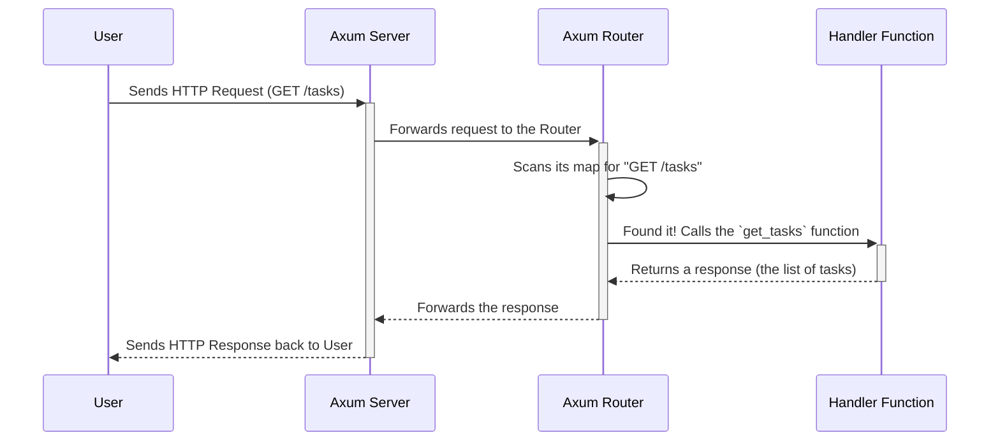

# Chapter 1: Axum Web Router

Welcome to the `axum_postgres_rust` project! This tutorial will guide you through the key concepts of this application, starting from the very beginning. In this first chapter, we'll explore the application's front door: the **Axum Web Router**.

### The Receptionist for Your Application

Imagine you're building a web application that manages a simple to-do list. Users will need to perform actions like:
- `GET /tasks`: to see all their tasks.
- `POST /tasks`: to add a new task.
- `DELETE /tasks/1`: to delete the task with ID 1.

When a request like `GET /tasks` arrives at your server, how does the server know which piece of code to run? It needs a system to look at the request's URL and HTTP method (`GET`, `POST`, etc.) and direct it to the correct function.

This is exactly what the **Axum Web Router** does. Think of it as a friendly and efficient receptionist in a large office building. The receptionist (the Router) greets every visitor (an incoming web request), checks their destination (the URL and method), and points them to the right office (the Rust function that handles the request). Without this receptionist, requests would be lost, and nothing would get done!

### Building Our Route Map

In our project, the router is defined in the `main` function inside the `src/main.rs` file. Let's look at how it's constructed, piece by piece.

The foundation is `Router::new()`, which creates a new, empty router. We then chain `.route()` calls to it to define our application's "map".

#### 1. The Welcome Route

```rust
// File: src/main.rs

let app = Router::new()
    .route("/", get(|| async {Json(json!({"message": "Welcome to the Axum Postgres Rust API"}))}));
```

This is the simplest type of route. Let's break it down:
- `.route("/", ...)`: This tells the router to listen for requests to the "root" URL (like `http://127.0.0.1:3000/`).
- `get(...)`: This specifies that this route only responds to the `GET` HTTP method.
- `|| async { ... }`: This is a Rust closure, which is like a small, anonymous function. It's our "handler" for this route. When a `GET` request for `/` comes in, this is the code that runs.

#### 2. Handling Multiple Actions on the Same URL

A single URL can often support multiple actions. For example, the `/tasks` URL is used for both fetching all tasks and creating a new one. Axum handles this elegantly by allowing you to chain methods.

```rust
// File: src/main.rs

// ... continuing from the previous snippet
.route("/tasks", get(get_tasks).post(create_task))
```

- `.route("/tasks", ...)`: We're defining rules for the `/tasks` URL.
- `get(get_tasks)`: If the request is a `GET`, the router will call our `get_tasks` Rust function.
- `.post(create_task)`: If the request is a `POST`, it will call our `create_task` function instead.

#### 3. Routes with Dynamic Parts

What if you want to update or delete a *specific* task? The URL needs to include the task's ID, like `/tasks/1` or `/tasks/42`. This ID is a dynamic value.

```rust
// File: src/main.rs

// ... continuing from the previous snippet
.route("/tasks/{task_id}", patch(update_task).delete(delete_task))
```

- `"/tasks/{task_id}"`: The `{task_id}` part is a **path parameter**. It's a placeholder. Axum knows that any request matching this pattern (like `/tasks/1`, `/tasks/25`, etc.) should be sent to this route's handlers.
- `patch(update_task)`: Handles requests to modify an existing task.
- `delete(delete_task)`: Handles requests to remove a task.

The value of `{task_id}` will be automatically extracted by Axum and given to our `update_task` and `delete_task` functions so they know which task to work on.

### What Happens When a Request Arrives?

Now that we've seen how the route map is built, let's trace the journey of a single request. Imagine a user wants to see all their tasks.

Here is a step-by-step diagram of what happens under the hood:



1.  A user's browser sends a `GET /tasks` request to our server's address.
2.  Our Axum server, which is constantly listening, receives this request.
3.  The server passes the request to our Router.
4.  The Router looks at its internal map. It checks: "Do I have a rule for the `GET` method at the `/tasks` path?"
5.  It finds the match: `get(get_tasks)`.
6.  The Router then calls the `get_tasks` function. We'll dive into what this function does in the next chapter.
7.  The `get_tasks` function runs, gets the data from the database, and returns a response.
8.  The Router passes this response back up, and the server sends it to the user's browser, which then displays the list of tasks.

### Starting the Server

Defining the router is just one part. The final step in `src/main.rs` is to actually start the server and tell it to use our router.

```rust
// File: src/main.rs

// 1. Create a "listener" that waits for traffic on a specific address
let listener = TcpListener::bind("127.0.0.1:3000")
    .await
    .expect("Failed to bind to address");

println!("Server running on {}", listener.local_addr().unwrap());

// 2. Tell Axum to serve our application (`app`) using this listener
axum::serve(listener, app)
    .await
    .expect("Failed to start server");
```

1.  `TcpListener::bind(...)` opens a port on your computer (in this case, port 3000). It's like unlocking the main entrance to your office building so visitors can come in.
2.  `axum::serve(listener, app)` is the magic command that starts the whole process. It connects our listener (the entrance) to our `app` (the receptionist/router) and says, "You're open for business!"

### Conclusion

You've just learned about the most fundamental part of our Axum application: the **Router**. It acts as the central hub, mapping incoming web requests to the specific Rust functions that know how to handle them. We saw how to define simple routes, chain different HTTP methods to a single URL, and use path parameters for dynamic data.

But the router only directs traffic. The real work happens inside the handler functions like `get_tasks` and `create_task`. How do they get data from the request? How do they access the database? We'll answer all of these questions in the next chapter.

Ready to see what the handler functions do? Let's move on to [Chapter 2: Handler Functions & Shared State](02_handler_functions___shared_state.md).

---
