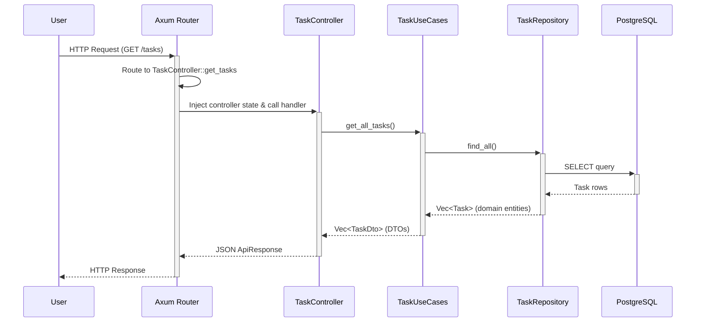

# Chapter 2: Handler Functions & Shared State (Updated for Hexagonal Architecture)

In [Chapter 1: Axum Web Router](01_axum_web_router.md), we met the application's "receptionist"—the router that directs incoming requests to the right place. But what happens after you've been directed to the right office? Someone actually has to do the work! In our **hexagonal architecture**, that work is done by **Handler Functions** in the infrastructure layer, which coordinate with the application layer use cases.

This chapter will explore how handler functions work in our hexagonal architecture and how they access shared dependencies through dependency injection.

### The Employee and the Shared Printer

Imagine our handler functions are employees in an office. A request comes in, like "Please fetch me all the tasks," and the router assigns it to the `get_tasks` employee. This employee's job is to go to the company's filing cabinet (the database), find the right documents (the tasks), and return them.

Now, imagine if every time an employee needed to print a document, they had to buy, set up, and power on a brand new personal printer. It would be incredibly slow and wasteful! A much better system is to have one powerful, shared printer that everyone can use.

This is the exact problem that **Shared State** solves for our web application. Instead of creating a new database connection for every single request (which is very slow), we create one "pool" of connections when the application starts. Then, we give every handler function a "keycard" to access this shared pool whenever it needs it.

This "keycard" in Axum is the `State` extractor. The shared "printer" is our `PgPool` (PostgreSQL Connection Pool).

### Anatomy of a Handler Function in Hexagonal Architecture

Let's look at a real handler function from our project, `get_tasks`, which handles `GET /tasks` requests. In our hexagonal architecture, this lives in the infrastructure layer's web adapter.

```rust
// File: src/infrastructure/adapters/web/task_controller.rs

impl TaskController {
    pub async fn get_tasks(
        State(controller): State<Arc<TaskController>>,
        Query(params): Query<TaskQuery>,
    ) -> Result<Json<ApiResponse<TaskListResponse>>, WebError> {
        let tasks = match params.priority {
            Some(priority) => controller.task_use_cases.get_tasks_by_priority(priority).await?,
            None => controller.task_use_cases.get_all_tasks().await?,
        };

        let response = ApiResponse::success(TaskListResponse { tasks });
        Ok(Json(response))
    }
}
```

Let's break this down:

1.  **`pub async fn get_tasks(...)`**: This declares an **asynchronous** method in the `TaskController`. The `async` keyword allows this function to perform asynchronous operations like calling use cases.

2.  **The Function Arguments (Extractors)**: 
    - `State(controller)`: Instead of directly accessing the database, we now access the `TaskController` which contains injected dependencies.
    - `Query(params)`: Extracts query parameters from the URL (like `?priority=5`).

3.  **Hexagonal Architecture Flow**: 
    - The controller delegates business logic to the **application layer** (`task_use_cases`)
    - It doesn't directly access the database - that's handled by the repository in the infrastructure layer
    - The controller's job is only HTTP concerns: extracting parameters, calling use cases, and formatting responses

4.  **The Return Type**: 
    - `Ok(Json<ApiResponse<TaskListResponse>>)`: Returns a structured JSON response with proper typing
    - `Err(WebError)`: Returns web-specific errors that are automatically converted to appropriate HTTP status codes

### Dependency Injection in Hexagonal Architecture

In our hexagonal architecture, the controller doesn't directly use a database pool. Instead, it uses **dependency injection** to access the application layer's use cases:

```rust
// The controller delegates to use cases
let tasks = controller.task_use_cases.get_all_tasks().await?;
```

**How Dependencies Are Wired:**

1. **Repository Implementation** (Infrastructure Layer):
   ```rust
   let task_repository: Arc<dyn TaskRepository> = 
       Arc::new(PostgresTaskRepository::new(db_pool));
   ```

2. **Use Cases** (Application Layer):
   ```rust
   let task_use_cases = Arc::new(TaskUseCases::new(task_repository));
   ```

3. **Controller** (Infrastructure Web Adapter):
   ```rust
   let task_controller = Arc::new(TaskController::new(task_use_cases));
   ```

This creates a **dependency chain**:
```
TaskController → TaskUseCases → TaskRepository → Database
```

**Benefits of This Approach:**
- **Separation of Concerns**: Controllers only handle HTTP, use cases handle business logic
- **Testability**: Easy to inject mock dependencies for testing
- **Flexibility**: Can swap database implementations without changing business logic
- **Maintainability**: Clear boundaries between layers

### How is the State Shared? A Look at `main.rs` in Hexagonal Architecture

In our hexagonal architecture, dependency injection happens during application startup in `main.rs`. Let's see how the layers are wired together:

**Step 1: Create Infrastructure Components**

```rust
// File: src/main.rs

// Load configuration
let config = Config::from_env()?;

// Create database connection pool
let db_pool = Database::connect(&config).await?;

// Create repository (infrastructure → domain port)
let task_repository: Arc<dyn TaskRepository> = 
    Arc::new(PostgresTaskRepository::new(db_pool));
```

**Step 2: Create Application Layer**

```rust
// Create use cases (application layer)
let task_use_cases = Arc::new(TaskUseCases::new(task_repository));
```

**Step 3: Create Web Infrastructure**

```rust
// Create controllers (infrastructure web adapter)
let task_controller = Arc::new(TaskController::new(task_use_cases));
```

**Step 4: Attach to Router**

```rust
let app = Router::new()
    .route("/", get(root_handler))
    .route("/health", get(health_check))
    .route("/tasks", 
        get(TaskController::get_tasks)
        .post(TaskController::create_task)
    )
    .with_state(task_controller); // <-- Inject the controller!
```

This `.with_state(task_controller)` makes the controller (and all its dependencies) available to all route handlers. The beautiful thing is that each layer only knows about the layer below it, creating clean separation of concerns.

### The Journey of a Request in Hexagonal Architecture

Let's visualize the entire flow from request to response through our hexagonal architecture layers.



**The Flow Explained:**

1. **User** sends a `GET /tasks` request
2. **Axum Router** finds the route and extracts the `TaskController` from state
3. **TaskController** (Infrastructure/Web) handles HTTP concerns and delegates to use cases
4. **TaskUseCases** (Application Layer) orchestrates business logic and calls repository
5. **TaskRepository** (Infrastructure/Database) handles data persistence concerns
6. **PostgreSQL** returns raw data
7. **Response flows back** through the same layers, with each layer doing its specific job:
   - Repository converts database rows to domain entities
   - Use cases convert domain entities to DTOs
   - Controller wraps DTOs in API response format

**Key Benefits of This Flow:**
- **Clear Responsibilities**: Each layer has one job
- **Testable**: Each layer can be tested in isolation
- **Flexible**: Can swap any layer implementation
- **Maintainable**: Changes in one layer don't affect others

### Conclusion

You've now learned about **handler functions in hexagonal architecture**. Instead of monolithic handlers that mix HTTP concerns with business logic, we now have:

- **Infrastructure Web Adapters** (TaskController) that handle HTTP concerns
- **Application Use Cases** that orchestrate business logic  
- **Domain Repositories** that define data access contracts
- **Infrastructure Database Adapters** that implement those contracts

Most importantly, you learned about **dependency injection** in hexagonal architecture. Instead of directly passing a database pool to handlers, we now:

1. Inject repositories into use cases
2. Inject use cases into controllers  
3. Inject controllers into the router

This creates a clean dependency chain where each layer only knows about the layer directly below it, making the system much more maintainable and testable.

The **shared state** pattern still exists, but now it's used to share the entire dependency tree through the `TaskController`, rather than just a database connection.

But how exactly are we talking to the database in the repository layer? The SQL queries are now isolated in the `PostgresTaskRepository`. Let's see how this works in practice.

Ready to dive into the data layer? Let's move on to: [Chapter 3: Compile-Time Verified SQL](03_compile_time_verified_sql.md).

---
