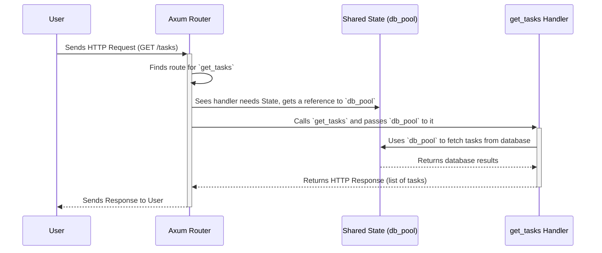

# Chapter 2: Handler Functions & Shared State

In [Chapter 1: Axum Web Router](01_axum_web_router.md), we met the application's "receptionist"—the router that directs incoming requests to the right place. But what happens after you've been directed to the right office? Someone actually has to do the work! In our application, that work is done by **Handler Functions**.

This chapter will explore what these functions are and, more importantly, how they access shared resources like a database connection in a smart and efficient way.

### The Employee and the Shared Printer

Imagine our handler functions are employees in an office. A request comes in, like "Please fetch me all the tasks," and the router assigns it to the `get_tasks` employee. This employee's job is to go to the company's filing cabinet (the database), find the right documents (the tasks), and return them.

Now, imagine if every time an employee needed to print a document, they had to buy, set up, and power on a brand new personal printer. It would be incredibly slow and wasteful! A much better system is to have one powerful, shared printer that everyone can use.

This is the exact problem that **Shared State** solves for our web application. Instead of creating a new database connection for every single request (which is very slow), we create one "pool" of connections when the application starts. Then, we give every handler function a "keycard" to access this shared pool whenever it needs it.

This "keycard" in Axum is the `State` extractor. The shared "printer" is our `PgPool` (PostgreSQL Connection Pool).

### Anatomy of a Handler Function

Let's look at a real handler function from our project, `get_tasks`, which handles `GET /tasks` requests.

```rust
// File: src/main.rs

async fn get_tasks(
    State(pg_pool): State<PgPool>
) -> Result<(StatusCode, String), (StatusCode, String)> {
    // ... code to fetch tasks from the database ...
}
```

Let's break this down:

1.  **`async fn get_tasks(...)`**: This declares an **asynchronous** function named `get_tasks`. The `async` keyword is crucial. It means this function can perform tasks that might take a while (like talking to a database over a network) without blocking the entire application. It can "pause" its work and let the server handle other requests, then "resume" when the database responds.

2.  **The Function Arguments (Extractors)**: The arguments to an Axum handler are special. They are called **extractors**. They "extract" information from the incoming request.
    - `State(pg_pool)`: This is our keycard! It's the `State` extractor. It tells Axum, "For this function to work, I need access to the shared state."
    - `pg_pool`: Axum unpacks the state and gives it to us in a variable named `pg_pool`. The type `PgPool` tells Axum exactly *which* piece of shared state we want (since a large app might have multiple shared resources).

3.  **The Return Type**: This function returns a `Result`. This is a standard way in Rust to handle operations that might succeed or fail.
    - `Ok((StatusCode, String))`: If everything goes well, it returns an HTTP status code (like `200 OK`) and a `String` containing the response data (our list of tasks as JSON).
    - `Err((StatusCode, String))`: If something goes wrong (e.g., the database is down), it returns an error status code (like `500 Internal Server Error`) and an error message.

### Putting the Shared State to Use

Now let's see how `get_tasks` actually uses the `pg_pool` it received.

```rust
// File: src/main.rs

async fn get_tasks(
    State(pg_pool): State<PgPool>
) -> Result<(StatusCode, String), (StatusCode, String)> {
    // This query asks the database for all tasks.
    // We will learn more about this in the next chapter.
    let rows = sqlx::query_as!(/*...query details...*/)
        .fetch_all(&pg_pool) // <-- Here's the magic!
        .await
        .map_err(|e|{
            // ... error handling ...
        })?;

    // If successful, format the tasks into a JSON string and return.
    Ok((
        StatusCode::OK,
        json!({"success": true, "tasks": rows}).to_string(),
    ))
}
```

The most important line is `.fetch_all(&pg_pool)`. This is where our handler function takes the database connection pool it received from the `State` extractor and uses it to execute the query. It's "swiping the keycard" to use the shared printer.

Without `State(pg_pool)`, our `get_tasks` function would have no way to talk to the database!

### How is the State Shared? A Look at `main.rs`

So, where does this shared state come from? We create it once when our application starts up in the `main` function.

**Step 1: Create the Database Pool**

First, we create the `PgPool` itself. This pool manages a set of open connections to our PostgreSQL database, ready to be used.

```rust
// File: src/main.rs

// create the database connection pool
let db_pool = PgPoolOptions::new()
    .max_connections(16)
    .connect(&database_url)
    .await
    .expect("Failed to create database connection pool");
```

**Step 2: Attach the State to the Router**

Next, when we build our router, we use the `.with_state()` method to attach our newly created `db_pool` to it.

```rust
// File: src/main.rs

let app = Router::new()
    .route("/", get(/* ... */))
    .route("/tasks", get(get_tasks).post(create_task))
    .route("/tasks/{task_id}", patch(update_task).delete(delete_task))
    .with_state(db_pool); // <-- The crucial step!
```

This `.with_state(db_pool)` call is what makes the `db_pool` available to *all* the routes and their handlers defined in this router. It's like giving every employee a keycard when they are hired.

### The Journey of a Request with Shared State

Let's visualize the entire flow from request to response.



1.  A user sends a `GET /tasks` request.
2.  The Axum Router finds the route that points to our `get_tasks` handler.
3.  The Router inspects the `get_tasks` function signature and sees it requires `State<PgPool>`.
4.  The Router "injects" the `db_pool` that was attached using `.with_state()` as an argument when it calls the handler.
5.  Our `get_tasks` handler now has the `db_pool` and uses it to query the database.
6.  The handler packages the result into an HTTP response and returns it.

This architecture is both powerful and efficient. All the complex work of managing database connections is handled for us by `sqlx::PgPool`, and Axum provides a clean and simple way to access it from anywhere with `State`.

### Conclusion

You've now learned about the "employees" of our application: the **handler functions**. You saw that they are `async` Rust functions that perform the core logic for each API route.

Most importantly, you learned about Axum's **shared state** system and the `State` extractor. You now understand that this is a critical pattern for building efficient web services, allowing handlers to share resources like a database connection pool instead of wastefully creating new ones for every request. We give them a "keycard" (`State`) to a "shared printer" (`PgPool`), and it makes everything run much more smoothly.

But how exactly are we talking to the database? That `sqlx::query_as!` macro looks interesting. It holds a secret power: it checks our SQL queries against the actual database *at compile time* to prevent typos and other common errors.

Ready to see how Rust can make your database queries safer? Let's move on to the next chapter: [Chapter 3: Compile-Time Verified SQL](03_compile_time_verified_sql.md).

---
