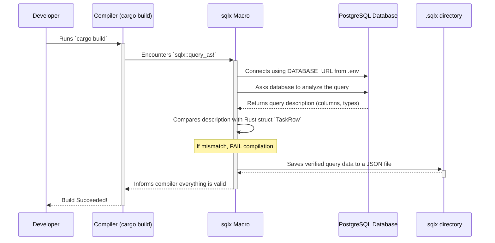

# Chapter 3: Compile-Time Verified SQL

In [Chapter 2: Handler Functions & Shared State](02_handler_functions___shared_state.md), we saw how our handler functions act as the "employees" of our application, using a shared database connection pool to get their work done. We briefly saw a strange-looking piece of code: `sqlx::query_as!`.

This chapter is all about that macro. It’s one of the most powerful features in our project, and it turns your Rust compiler into a strict, eagle-eyed proofreader for your database queries.

### The Problem: The Danger of Plain Strings

Imagine you're writing a critical SQL query to fetch user data. In many programming languages, you would write this query as a simple string:

```sql
"SELECT user_id, user_name, user_emal FROM users WHERE user_id = 1"
```

Do you see the bug? I made a typo: `user_emal` instead of `user_email`.

With a simple string, your program would compile just fine. The error would only appear at **runtime**—when a user actually tries to access their data. The application would try to run this broken query, the database would reject it, and your program would likely crash or return an ugly error to the user. This is a very common source of bugs.

Wouldn't it be better if your code editor or compiler could tell you about this typo *before* you even finish writing the program?

### The Solution: A Grammar Checker for Your SQL

This is exactly what **Compile-Time Verified SQL** does. The `sqlx` library provides special macros (`query!`, `query_as!`, etc.) that are much smarter than plain strings.

When you compile your Rust code (by running `cargo build` or `cargo run`), this macro does something amazing:

1.  It connects to your actual database.
2.  It sends your SQL query to the database to be checked.
3.  It verifies that the tables and columns you referenced (like `tasks` and `task_id`) actually exist.
4.  It checks that the data types in the database (e.g., a number, some text) match the data types in your Rust code (e.g., an `i32`, a `String`).

If any of these checks fail, your code **will not compile**. You are forced to fix the bug right away, long before it can ever cause a problem in a running application.

### Using `sqlx::query_as!` in Practice

Let's revisit our `get_tasks` handler from `src/main.rs` to see this in action. The goal of this function is to fetch all task records from the database and turn them into a list of Rust structs.

First, we need a Rust struct that perfectly mirrors the structure of a row in our `tasks` table.

```rust
// File: src/main.rs

#[derive(Serialize)]
struct TaskRow {
    task_id: i32,
    name: String,
    priority: Option<i32>,
}
```

*   `TaskRow`: A blueprint for what a single task looks like in Rust.
*   `task_id: i32`: The task's ID is a 32-bit integer.
*   `name: String`: The task's name is text.
*   `priority: Option<i32>`: The priority is an integer, but it might not exist for every task (it's "nullable" in the database), so we use Rust's `Option` type to represent this possibility.

Now, let's look at the query itself:

```rust
// File: src/main.rs

async fn get_tasks(
    State(pg_pool): State<PgPool>
) -> Result</*...*/> {
    let rows = sqlx::query_as!(
        TaskRow, 
        "SELECT task_id, name, priority FROM tasks order by task_id"
    )
    .fetch_all(&pg_pool)
    .await
    // ...error handling...
}
```

This little block is doing a lot of work:
*   `sqlx::query_as!(`: This is the macro that triggers the compile-time check.
*   `TaskRow,`: This is the first argument. We're telling `sqlx`, "When you get the data from the database, please try to fit each row neatly into our `TaskRow` struct."
*   `"SELECT ..."`: This is our SQL query. `sqlx` will analyze this string against the database.

During compilation, `sqlx` checks if the columns returned by `SELECT task_id, name, priority...` perfectly match the fields in `TaskRow` (`task_id`, `name`, `priority`) both in name and in type.

### What Happens When You Make a Mistake?

Let's try to break it! Imagine you make a typo in the SQL query:

```rust
// A broken query -- this WILL NOT compile!
let rows = sqlx::query_as!(
    TaskRow, 
    "SELECT task_id, nmae, priority FROM tasks" // "nmae" is a typo!
)
// ...
```

When you try to run `cargo build`, you won't get a running program. Instead, you'll get a clear error message right in your terminal, something like this:

```text
error: error returned from database: column "nmae" does not exist
 --> src/main.rs:88:18
  |
88|       let rows = sqlx::query_as!(
  |  __________________^
89| |         TaskRow,
90| |         "SELECT task_id, nmae, priority FROM tasks"
91| |     )
  | |_____^
```

This is incredibly helpful! The compiler is telling you the exact file, the exact line, and the exact reason your database query is wrong. You fix the typo from `nmae` to `name`, compile again, and everything works.

### How Does it Work Under the Hood? The `.sqlx` Directory

This process isn't magic. It relies on a helper tool called `sqlx-cli` and a special directory in our project: `.sqlx`.

Here's a step-by-step look at the compile-time journey:



The first time you compile, `sqlx` connects to the database specified in your `DATABASE_URL` environment variable. After it successfully verifies a query, it saves all the information it learned (the query text, the parameter types, the output column types) into a JSON file inside the `.sqlx` directory.

Take a look at one of these files, like `.sqlx/query-c1abbb6f12011bcee57ec41d451e2a35b8c06483622e7be99c9ee303272e23ae.json`:

```json
{
  "db_name": "PostgreSQL",
  "query": "SELECT task_id, name, priority FROM tasks order by task_id",
  "describe": {
    "columns": [
      { "name": "task_id", "type_info": "Int4" },
      { "name": "name", "type_info": "Varchar" },
      { "name": "priority", "type_info": "Int4" }
    ],
    "parameters": { "Left": [] },
    "nullable": [ false, false, true ]
  },
  "hash": "..."
}
```

This file is a **cache**. On all future compilations, if the query string hasn't changed, `sqlx` will just read this file instead of connecting to the database again. This makes subsequent builds much faster and, crucially, allows you to compile your project even if you're offline or the database is unavailable.

### Conclusion

You've just learned about one of the most significant safety features in modern Rust web development. By using `sqlx`'s macros, we leverage the Rust compiler to act as a powerful automated proofreader for our database interactions. This eliminates a whole class of common runtime errors by catching them at the earliest possible moment: during compilation.

This compile-time verification gives us incredible confidence that our application's SQL is correct and that our Rust code is perfectly in sync with our database schema.

We've now seen how our application routes requests, how handlers do their work, and how we talk to the database safely. But how do we manage settings like the database URL and server address without hardcoding them?

Let's explore how our project handles its settings in the next chapter: [Chapter 4: Application Configuration](04_application_configuration.md).

---
